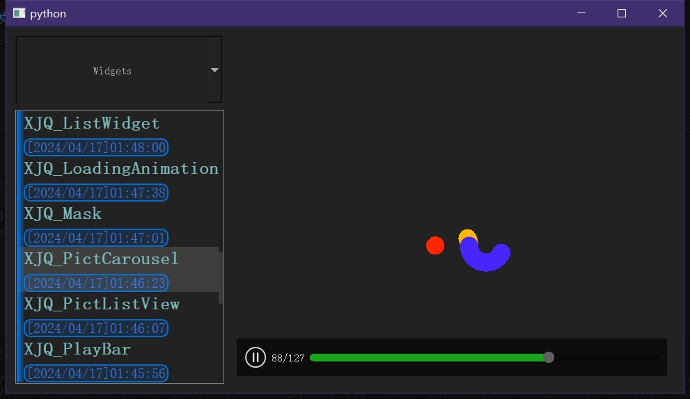
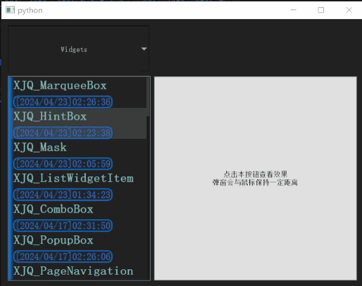
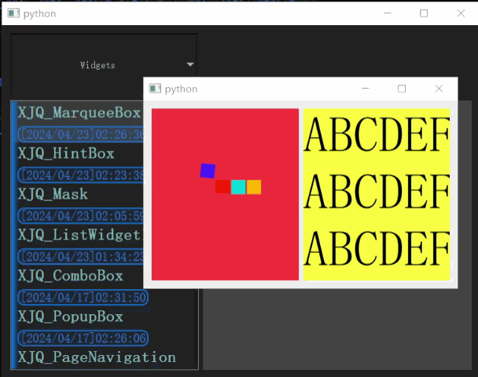
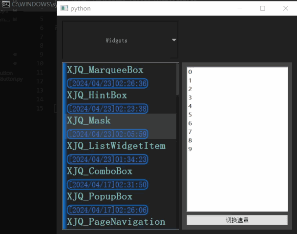
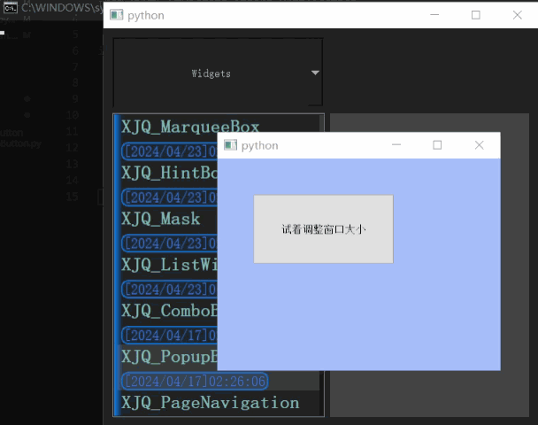

# XJ_Python

在开发过程中写下的一些有用的类，主要与PyQt5相关。

- 可运行``ModuleTest.py``查看XJ包中每个模块的测试样例的效果。
- 直接下载整个项目然后运行``buildWheel.bat``脚本直接生成并安装轮子，
- 实际上安装轮子太过于费事，通常都是将项目代码拉到另一个需要的项目下面使用，或者设置一下Python环境路径``PYTHONPATH``然后将项目代码丢到这个环境路径中；

 

# 部分Widgets模块展示：

##### 弹窗，功能与``QMenu``出现一定程度的重合(同是可以将窗口弹出至鼠标附近)

 

##### 跑马灯容器，可以装载任意控件，滚动方向速度等均可调整

 

##### 遮罩类，往其中加入动画控件便可实现加载动画效果

 

##### 鼠标触发器，可以设定范围，进入、离开、范围内悬停均会触发信号

 

##### 图片列表，可打开大量图片并且有加载动画以及资源超时自动释放(避免占用过多内存)，鼠标悬浮时可查看预览图

 

##### 冒泡/消息提示弹窗，方位顺序可调整，例如优先显示在某块区域左侧或下方

 

