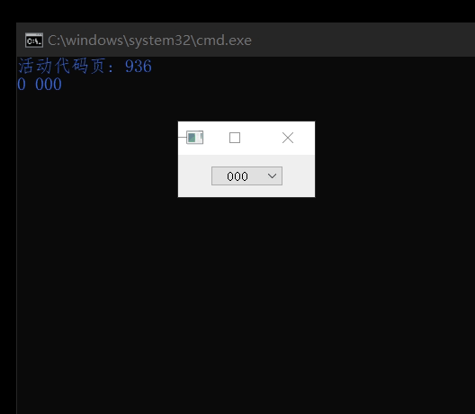

# XJQ_ComboBox


QComboBox的简单优化，主要处理了一些样式上的问题，例如颜色、大小、文本居中
以及新增一个延迟动作行为，
当前行发生变化时并不会立即发送信号indexChanged，而是在指定的延迟时间后触发




```py

from XJ.Widgets import XJQ_ComboBox

import sys
from PyQt5.QtWidgets import QWidget,QHBoxLayout,QApplication


if True:
	app = QApplication(sys.argv)

	cb=XJQ_ComboBox()
	cb.Set_List([str(i)*3 for i in range(20)])
	cb.indexChanged.connect(lambda index,text:print(index,text))
	# print(cb.count())

	wid=QWidget()
	hbox=QHBoxLayout(wid)
	hbox.addStretch(1)
	hbox.addWidget(cb,1)
	hbox.addStretch(1)
	wid.show()

	style='''
			QComboBox{
				font-size:20px;
				color:rgba(0,0,0,255);
				background:rgba(96,192,255,192);
				border-radius:10px;
				min-width:50px;
				text-align:center;
			}
			QComboBox::drop-down{
				width:0;
				image:none;
			}

			QComboBox QAbstractItemView {
				font-size:25px;
				min-width: 50px;
				font-weight:0;
				font-family:serif;
				background-color: rgba(224, 224, 128, 255);
			}
			QComboBox QAbstractItemView::item {
				height: 30px;
				background-color: rgba(237, 0, 0,128);
			}

			QComboBox QScrollBar
			{
				background: rgba(255,255,255,5%);
				width: 5px;
			}
			QComboBox QScrollBar::add-line {
				width:0;
				height:0;
			}
			QComboBox QScrollBar::sub-line {
				width:0;
				height:0;
			}
			QComboBox QScrollBar::handle {
				background: rgba(64,64,64,75%);
			}
			QComboBox QScrollBar::sub-page {
				background: rgba(0,0,0,30%);
			}
			QComboBox QScrollBar::add-page {
				background: rgba(0,0,0,30%);
			}
		'''

	# cb.setStyleSheet(style)

	sys.exit(app.exec_())

```