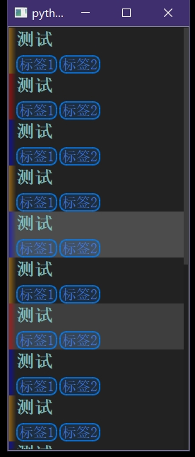

# XJQ_ListView

半成品，可以塞控件的列表，但目前只建议塞XJQ_ListViewItem(因为单元格高度问题带来了不少麻烦)，
本质上是继承QListWidget并仅仅简单封装几个行为罢了

单行选中，屏蔽拖拽操作，主要作为导航栏使用



```py
from XJ.Widgets import XJQ_ListView
from XJ.Widgets import XJQ_ListViewItem

import sys
from PyQt5.QtWidgets import QApplication

if True:
	app = QApplication(sys.argv)

	lst=[
		('测试',['标签1','标签2'],'rgba(255,160,0,128)'),
		('测试',['标签1','标签2'],'rgba(255,0,0,128)'),
		('测试',['标签1','标签2'],'rgba(0,0,255,128)'),
		('测试',['标签1','标签2'],'rgba(255,160,0,128)'),
		('测试',['标签1','标签2'],'rgba(0,0,255,128)'),
		]

	lv=XJQ_ListView()
	lv.show()
	lst=[XJQ_ListViewItem(*lst[i%5]) for i in range(16)]
	for wid in lst:
		lv.Opt_AppendWidget(wid)
	# lv.Opt_RemoveRow(0)
	# lv.Opt_Clear()
	lv.currentRowChanged.connect(lambda item:print(item))

	sys.exit(app.exec_())
```
