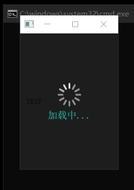

# XJQ_LoadingMask

加载动画蒙版，遮蔽控件的不二之选，

gif动画可以指定，文字也可以指定(文字是静态的，通常也不需要动态文字

动画大小以及文字的颜色和大小均可指定，实在不满足可以设置样式表



```py
from XJ.Widgets import XJQ_LoadingMask
from XJ.Function import GetRealPath

import os
import sys
from PyQt5.QtWidgets import QApplication,QWidget,QLabel,QVBoxLayout

if True:
	app = QApplication(sys.argv)

	# path=GetRealPath('../icons/上传.png')
	path=GetRealPath('../icons/加载动画-1.gif')

	win=QWidget()
	wid=XJQ_LoadingMask(path)
	wid.setParent(win)

	lb=QLabel("TEST")
	vbox=QVBoxLayout(win)
	vbox.addWidget(lb)
	win.show()
	win.resize(200,300)

	sys.exit(app.exec_())
```


