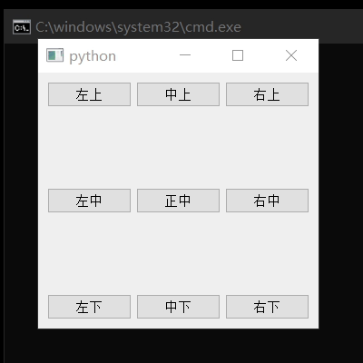

# XJQ_LocateBox

定位型容器，或者称其为牛皮癣，能够黏在指定控件的某个位置




```py
from XJ.Widgets import XJQ_LocateBox 

from PyQt5.QtWidgets import QApplication,QWidget,QPushButton

if True:
	app = QApplication([])

	wid=QWidget()
	lstH=[Qt.AlignLeft,Qt.AlignHCenter,Qt.AlignRight]
	lstV=[Qt.AlignTop,Qt.AlignVCenter,Qt.AlignBottom]
	for h in range(3):
		for v in range(3):
			H=lstH[h]
			V=lstV[v]
			tx=''
			tx+='左' if h<1 else '中' if h==1 else '右'
			tx+='上' if v<1 else '中' if v==1 else '下'
			if(tx=='中中'):
				tx='正中'
			btn=QPushButton(tx)
			btn.clicked.connect(lambda:print("Click"))
			lbox=XJQ_LocateBox(wid,btn,H|V,(10,10))
	wid.show()
	wid.resize(400,400)
	app.exec_()
```

