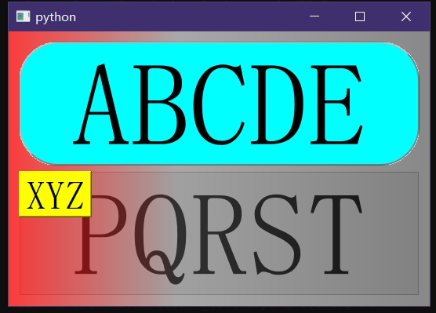

# XJQ_Mask

1. 即用即弃：蒙版对象创建时即刻生效，不用时通过mask.setParent(None)弃用即可，虽然可以调用mask.hide()暂时隐藏但意义不大
2. 可指定不遮挡的对象
3. 可指定特殊颜色，甚至是渐变色(因为本质是调用setStyleSheet函数进行设置的)
4. 可设置点击穿透以满足特殊场合
5. 遮罩单击时会触发``clicked``信号，用于实现“点击空白位置以取消”的操作




```py
from XJ.Widgets import XJQ_Mask

import sys
from PyQt5.QtWidgets import QPushButton,QVBoxLayout,QApplication,QWidget

if True:
	app = QApplication(sys.argv)

	lb_1=QPushButton("ABCDE")
	lb_1.setStyleSheet("font-size:150px ; border:2px groove gray;border-radius:50px;padding:2px 4px;border-style: outset;}"
										   "QPushButton{background-color: rgb(0, 224, 224);}"
										   "QPushButton:hover{background-color:rgb(0, 255, 255); color: black;}"
										   "QPushButton:pressed{background-color:rgb(0, 192, 192);border-style: inset;")

	lb_2=QPushButton("PQRST")
	lb_2.setStyleSheet("font-size:150px")

	lb_3=QPushButton("XYZ",lb_2)
	lb_3.setStyleSheet("font-size:50px ; background-color:#FFFF00")

	win=QWidget()
	vbox=QVBoxLayout(win)
	vbox.addWidget(lb_1)
	vbox.addStretch(1)
	vbox.addWidget(lb_2)
	win.show()
	win.resize(755,400)

	# msk=XJQ_Mask(win,lb_1,color='rgba(0,0,0,192)')
	# msk=XJQ_Mask(win,lb_1,lb_2,color='rgba(0,0,0,192)')
	# msk=XJQ_Mask(win,(lb_1,True),lb_3,color='#FF0000')
	# msk=XJQ_Mask(win,clickBlock=False,color='qlineargradient(x1:0, y1:0, x2:1, y2:0,stop:0 rgba(255,0,0,192), stop: 0.4 rgba(96,96,96,128), stop:1 rgba(32,32,32,128))')
	msk=XJQ_Mask(win,(lb_1,True),lb_3,color='qlineargradient(x1:0, y1:0, x2:1, y2:0,stop:0 rgba(255,0,0,192), stop: 0.4 rgba(96,96,96,128), stop:1 rgba(32,32,32,128))')
	# msk=XJQ_Mask(win,(lb_1,True),lb_3,color='qlineargradient(x1:0, y1:0, x2:1, y2:0,stop:0 rgba(255,0,0,128), stop: 0.4 rgba(96,96,96,128), stop:1 rgba(32,32,32,128))')
	# msk=XJQ_Mask(win,(lb_1,True),lb_3,color='rgba(255,0,0,192)')
	# msk=XJQ_Mask(win,(lb_1,True),lb_3,color='rgba(0,0,0,192)')
	# msk=XJQ_Mask(win,lb_1,lb_3,color='rgba(0,0,0,192)')
	# msk=XJQ_Mask(lb_2,lb_1,lb_3,color='rgba(0,0,0,192)')
	# msk.setParent(None)
	msk.clicked.connect(lambda:print("Click!") or msk.setParent(None))
	msk.show()
	# msk.hide()

	sys.exit(app.exec())
```

