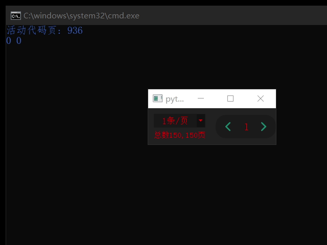

# XJQ_PageNavigation

页导航栏，半成品，按钮少，说好听点就是“精简”

因为布局空间不足并且目前也没这需求所以没做多按钮的导航栏

<br>

每页显示数可定、数据总数可定，

当前页展示数据发生变化时发出信号change(int,int)，分别对应数据的索引值和数据个数



```py
from XJ.Widgets import XJQ_PageNavigation 

import sys
from PyQt5.QtWidgets import QApplication

if True:
	app = QApplication(sys.argv)

	pn=XJQ_PageNavigation(150)
	pn.Set_PerCountList([1,2,3,4,5,10,100])
	pn.resize(250,50)
	pn.changed.connect(lambda start,count:print(start,start+count-1))
	pn.setStyleSheet('''
		color:#FF0000;
		background:#222222;
		margin:0;
	''')
	pn.show()

	sys.exit(app.exec_())
```