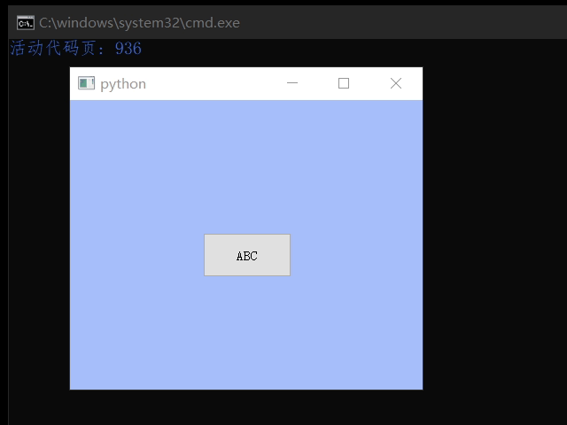

# XJQ_PopupBox

弹窗式容器，其行为可参考组合框点击时弹出的列表，
只不过可以承载控件而非仅仅的列表，并且点击容器元素时并不会像组合框列表那样消失

目前的缺点是如果窗口一下缩小到弹窗看不见的大小时弹窗不会更新位置,
只不过这个问题影响不大，连调用两次show()即可



```py
from XJ.Widgets import XJQ_PopupBox 

from PyQt5.QtWidgets import QApplication,QPushButton,QHBoxLayout,QLabel,QVBoxLayout,QWidget
from PyQt5.QtCore import Qt

if True:
	app = QApplication([])

	win=QWidget()
	win.setFocusPolicy(Qt.ClickFocus)
	win.show()
	# win.resize(900,700)
	win.setStyleSheet('.QWidget{background:rgb(164,192,255)}')
	win.resize(400,300)
	btn=QPushButton('ABC',win)
	btn.setGeometry(150,150,100,50)
	btn.show()

	wid=QWidget()
	wid.setStyleSheet('.QWidget{background:transparent}')
	vbox=QVBoxLayout(wid)
	for i in range(3):
		vbox.addWidget(QPushButton(str(i)*3))

	pbox=XJQ_PopupBox(btn)#弹窗，指向目标
	# pbox=XJQ_PopupBox(btn,arrowLength=20,arrowWidth=20)
	# pbox=XJQ_PopupBox(btn,arrowLength=100,arrowWidth=50)
	btn.clicked.connect(lambda:pbox.show())
	pbox.Set_Content(wid)#设置容器
	pbox.resize(None)
	pbox.show(True)

	app.exec_()
```