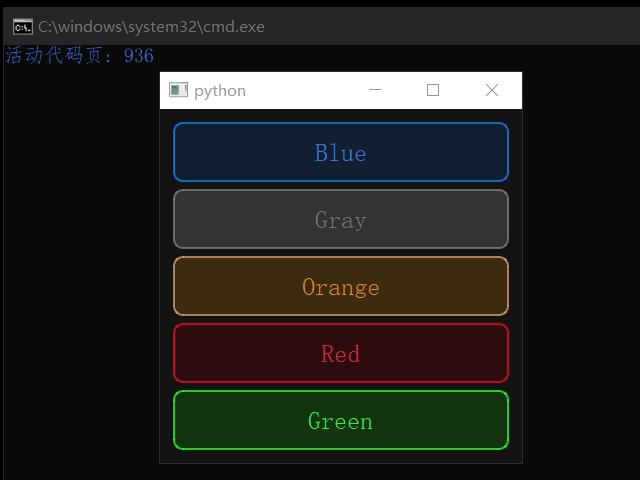

# XJQ_Tag

颜色风格参考了Element-plus的按钮样式：https://element-plus.org/zh-CN/component/button.html

标签可点击，点击后会触发clicked信号

标签样式在XJQ_Tag.Style中提供，目前有五种颜色：蓝红绿灰橙

当然，对目前的样式不满的可以自行传入其他样式





```py
from XJ.Widgets import XJQ_Tag 

import sys
from PyQt5.QtWidgets import QApplication,QLabel,QWidget,QVBoxLayout

if True:
	app = QApplication(sys.argv)

	win=QWidget()
	win.show()

	vbox=QVBoxLayout(win)

	clickTest=False
	index=0
	for style in [
			XJQ_Tag.Style.Blue,
			XJQ_Tag.Style.Gray,
			XJQ_Tag.Style.Orange,
			XJQ_Tag.Style.Red,
			XJQ_Tag.Style.Green,
			]:
		tag=XJQ_Tag(win,style.name,style,clickable=clickTest or index%2==0)
		tag.clicked.connect(lambda val:print(val))
		vbox.addWidget(tag)
		index+=1
		tag.show()
	win.setStyleSheet('background:rgb(20,20,20)')
	sys.exit(app.exec_())

```

